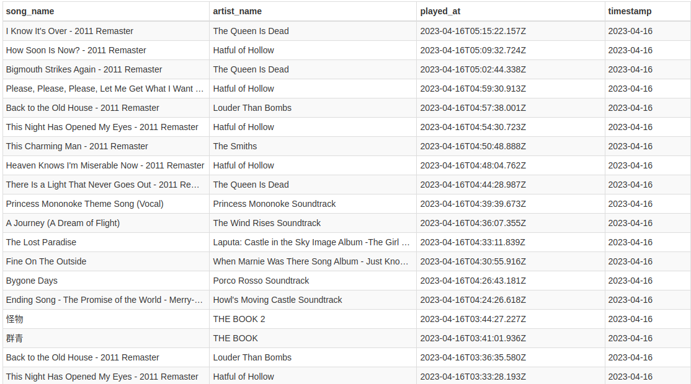

# SPOTIFY ETL PROJECT
Spotify is one of the largest music streaming. It gives you access to millions of songs.

This repo is trying to give the informations about the tracks we played day-to-day.

We will retrieving the data, the add validation to make sure the information is ready to stored in database.

You need create account and generate ```CLIENT_ID``` and ```CLIENT_SECRET``` store in ```.env``` in Spotify Dashboard Dev to run this program.

## Run Locally

Clone the project

```bash
  git clone
```

Actived env pyhon

```bash
  source /your-env-dir
```

Install dependencies

```bash
  pip3 install -r requirement.txt
```

Run the program

```bash
  python3 main.py
```

## Screenshots



## Optimizations

There are some limitations in this project. We need to run this program automatically so we don't need to run the program manually.

## Authors

- [@armerayfr](https://github.com/armerayfr?tab=repositories)